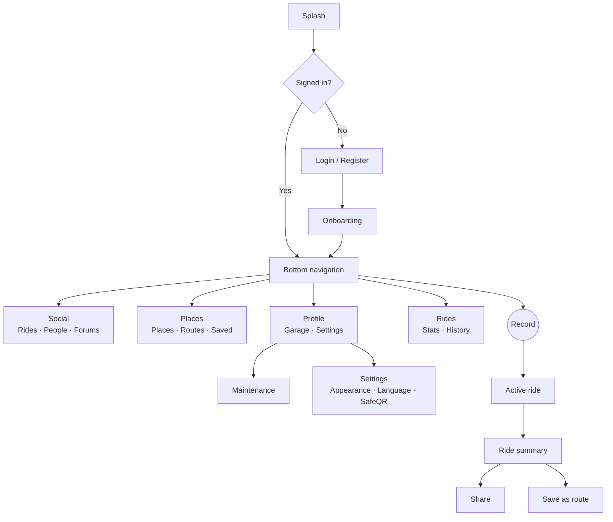
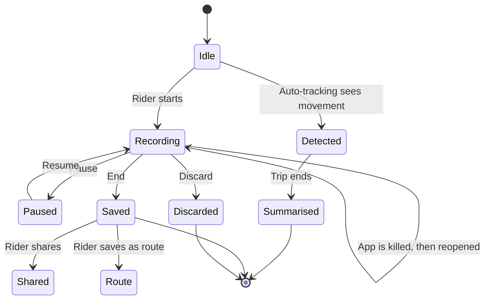
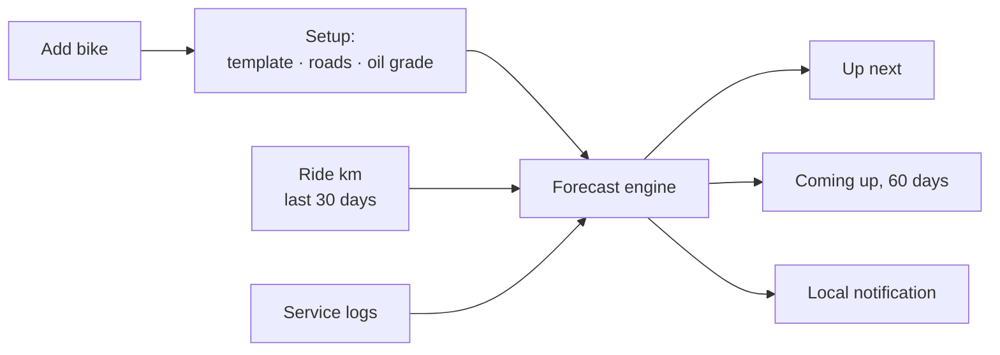
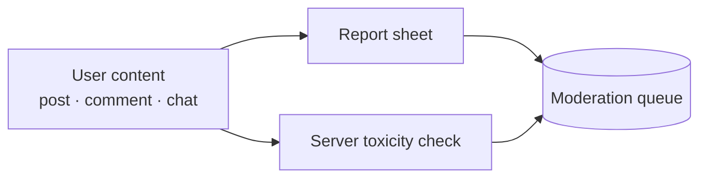
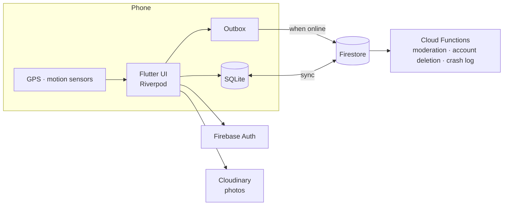

# ThrottleIQ — Product Requirements Document

_Version 1.0.0-beta.4.2.0+23 · Updated 2026-10-07 · Style: ASD-STE100 (Simplified Technical English)_

**Status key:** ✅ Built · 🟡 Partly built · ⛔ Not live · 📱 Not checked on a device

---

## 1. Purpose

ThrottleIQ is a mobile app for motorcycle riders in Bangladesh.
It records rides, tracks bike maintenance, and connects riders.
It works without a network. It syncs when the network returns.

---

## 2. Problem and users

| Problem | Effect on the rider |
|---|---|
| Riders do not know when a bike needs service. | Parts fail. Repairs cost more. |
| Riders have no record of their rides. | They cannot see progress. |
| Riders cannot find fuel, garages, or checkposts. | They lose time on the road. |
| Rider advice is split across chat groups. | Good answers are lost. |
| The network is weak on many roads. | Cloud-only apps fail. |

| User | Need |
|---|---|
| Commuter | Log daily rides. Know when service is due. |
| Enthusiast | See speed, score, and routes. Ride in a group. |
| Family member | See the rider's live location when the rider shares it. |

---

## 3. Goals and non-goals

**Goals**

1. Record a ride with no data loss.
2. Tell the rider what service the bike needs next.
3. Let riders find places, share rides, and ask questions.
4. Work offline.

**Non-goals**

- Crash alerts to emergency contacts (⛔ off in this release; see §6.6).
- Street-by-street navigation. The app gives turn hints from the saved route only.
- Paid features. The part-order button is a demo.
- Platforms other than Android and iOS.

---

## 4. Product map

---

## 5. Ride life cycle

---

## 6. Functional requirements

### 6.1 Account

| ID | Requirement | Status |
|---|---|---|
| ACC-1 | The rider can sign in with email or Google. | ✅ |
| ACC-2 | The rider can set a profile and a privacy level (Everyone, Mutuals, Only me). | ✅ |
| ACC-3 | The rider can choose who sees their bikes. | ✅ |
| ACC-4 | The rider can delete the account. The server then removes the rider's data. | ✅ |

### 6.2 Ride recording

| ID | Requirement | Status |
|---|---|---|
| REC-1 | The app records GPS position, speed, and motion. | ✅ |
| REC-2 | The app records with the screen off. | ✅ |
| REC-3 | The rider can pause, resume, end, or discard a ride. | ✅ |
| REC-4 | The app keeps a ride if the OS stops the app. The rider can resume it. | ✅ 📱 |
| REC-5 | The app shows distance, duration, average speed, top speed, and time in traffic. | ✅ |
| REC-6 | The app gives each ride a score out of 100. | ✅ |
| REC-7 | The app flags hard brakes and rapid acceleration. | ✅ |
| REC-8 | The rider can export a ride as GPX or JSON. | ✅ |
| REC-9 | The rider can share live location through a link. The rider must turn it on. | ✅ |
| REC-10 | The rider can end and share a ride while offline. The app sends it later. | ✅ 📱 |

### 6.3 Auto-tracking

| ID | Requirement | Status |
|---|---|---|
| AUT-1 | The rider can turn on background ride detection. | ✅ |
| AUT-2 | The rider can set active hours. | ✅ |
| AUT-3 | The app stops detection during a manual ride. | ✅ 📱 |
| AUT-4 | The app shows one daily summary, not one ride per trip. | ✅ 📱 |
| AUT-5 | The app merges trips with stops of 20 minutes or less. | ✅ |
| AUT-6 | The app sends a summary notification at 21:00. | ✅ 📱 |
| AUT-7 | The app deletes old raw fixes after summary. | 🟡 No code calls the purge yet. |

### 6.4 Garage and maintenance

| ID | Requirement | Status |
|---|---|---|
| MNT-1 | The rider can add, edit, and delete bikes with a photo and color. | ✅ |
| MNT-2 | The app shows the next service by km or date. The first limit wins. | ✅ 📱 |
| MNT-3 | The app shows "unknown" when it has no baseline. It does not guess. | ✅ |
| MNT-4 | The app picks a schedule from the bike brand, model, and cc. | ✅ |
| MNT-5 | The app shortens intervals for harsh riding or bad roads. The factor stays at 0.7 or more. | ✅ |
| MNT-6 | The rider can log a service visit with items, cost, shop, and receipt photo. | ✅ |
| MNT-7 | The rider can undo a log and edit a visit. | ✅ |
| MNT-8 | The app sends a local notification when a service is due. | ✅ 📱 |
| MNT-9 | The app tracks legal papers (tax token, insurance, fitness, registration, licence). | ✅ |
| MNT-10 | The app shows running cost per km. | ✅ |
| MNT-11 | The rider can export the service record as PDF. | ✅ |
| MNT-12 | The rider can run a 6-point quick check. | ✅ |

### 6.5 Places and routes

| ID | Requirement | Status |
|---|---|---|
| PLC-1 | The rider can search places by name, category, and radius. | ✅ |
| PLC-2 | The app shows places on a map and in a list. | ✅ 📱 |
| PLC-3 | The rider can add a place, with photos. | ✅ |
| PLC-4 | The rider can save places. Saved places work offline. | ✅ |
| PLC-5 | The app shows AI cameras and checkposts as a Highway Radar. | ✅ |
| PLC-6 | The rider can save a ride as a route, private or public. | ✅ |
| PLC-7 | The rider can follow a route. The app records the ride and shows turn hints. | ✅ 📱 |
| PLC-8 | The app shows a warning when the rider is more than 100 m off route. | ✅ |

### 6.6 Safety

| ID | Requirement | Status |
|---|---|---|
| SAF-1 | The rider can store emergency contacts. | ✅ |
| SAF-2 | The rider can show a medical QR card (SafeQR) and print stickers. | ✅ |
| SAF-3 | The app detects a suspected crash during a ride. | ⛔ Switch is off. Thresholds are not field-tested. |
| SAF-4 | The app alerts emergency contacts after a crash. | ⛔ The server function only writes a log. It sends no SMS or e-mail. |
| SAF-5 | The rider can cancel a crash alert. | ⛔ Depends on SAF-3. |
| SAF-6 | The history marks a ride with a crash signal. | ✅ |

> **Rule:** The app must not say it will contact anyone until SAF-4 is built.

### 6.7 Social

| ID | Requirement | Status |
|---|---|---|
| SOC-1 | The rider can share a ride with photos, score, and map. | ✅ |
| SOC-2 | The rider can comment, vote, and follow other riders. | ✅ |
| SOC-3 | The rider can ride in a group of 2 to 11 riders. The rider invites friends or shares a 6-character code. | ✅ 📱 |
| SOC-4 | Group members see each other on a live map. | ✅ 📱 |
| SOC-5 | Forums have post types: troubleshoot, DIY guide, gear review, general. | ✅ 📱 |
| SOC-6 | The author can mark a post solved. Only the author can. The server enforces this. | ✅ |
| SOC-7 | A post can carry up to 4 photos, a ride card, or a maintenance card. | ✅ 📱 |
| SOC-8 | Riders can send private chat messages. | ✅ |

### 6.8 Trust and safety

| ID | Requirement | Status |
|---|---|---|
| TNS-1 | Any user can report content. | ✅ |
| TNS-2 | The server checks each chat message against a word list. | 🟡 English words only. It misses Bangla. |
| TNS-3 | The app encrypts all data in transit (HTTPS/TLS). | ✅ |
| TNS-4 | Firebase Auth stores passwords. The app does not store them. | ✅ |
| TNS-5 | Firestore rules enforce who can read and write each record. | ✅ |
| TNS-6 | The app must not share location without a rider action. | ✅ |
| TNS-7 | Pooled road-speed data has no user ID and no exact coordinates. | ✅ |

### 6.9 Settings and display

| ID | Requirement | Status |
|---|---|---|
| SET-1 | The rider can choose Vibe (Boxy, Curvy), Brightness, and one of 7 color families. | ✅ |
| SET-2 | The rider can choose English or Bangla. Numbers stay 0–9. | ✅ |
| SET-3 | The rider can turn usage statistics off. | ✅ |
| SET-4 | Home-screen widgets: Start ride, Start auto-tracking, Ride stats, Next service. | ✅ Android · 🟡 iOS 📱 |

---

## 7. System design

| Part | Choice |
|---|---|
| App | Flutter, Riverpod |
| Local data | SQLite (schema v22) |
| Cloud data | Firestore, Firebase Auth |
| Photos | Cloudinary |
| Server code | Cloud Functions |
| Map | OpenStreetMap tiles |
| Weather | Open-Meteo (no key) |

**Rule:** The app writes to SQLite first. The outbox sends changes to the cloud later.

---

## 8. Non-functional requirements

| ID | Requirement |
|---|---|
| NFR-1 | Every core flow must work offline: record, end, share, log service. |
| NFR-2 | The app must not lose a ride when the OS stops the app. |
| NFR-3 | The app must not block the screen on a network call. A network call must time out. |
| NFR-4 | Background GPS must use little battery. The app must stop GPS when it does not need it. |
| NFR-5 | Every screen must have English and Bangla text. |
| NFR-6 | Every list must load lazily. |
| NFR-7 | Every user-facing error must use plain words. It must not show raw exceptions. |
| NFR-8 | Every change must pass `flutter analyze` and `flutter test`. |
| NFR-9 | Firestore rules must pass their own tests before deploy. |

---

## 9. Constraints

- One developer.
- Zero paid budget. No paid APIs. No paid routing engine.
- Cloud Functions need the Blaze plan. Crash alert delivery waits for this.
- The app is in beta. It is not on the Play Store.
- The founder tests on one iPhone 15 and Android devices.

---

## 10. Success metrics

Targets are **proposed**. The founder must confirm them.

| Metric | Why it matters | Proposed target |
|---|---|---|
| Rides recorded per active rider, per week | Core use | 3 or more |
| Riders with a bike set up for maintenance | Retention hook | 60% of active riders |
| Day-30 retention | Habit | 25% |
| Crash-free sessions | Trust | 99.5% |
| Rides lost after an app kill | Data safety | 0 |

---

## 11. Open items

| # | Item | Owner |
|---|---|---|
| 1 | Choose how crash alerts reach contacts (SMS, push, or e-mail). Then build SAF-3 to SAF-5. | Founder |
| 2 | Replace the English-only word list with real moderation (TNS-2). | Developer |
| 3 | Call the purge from the app (AUT-7). Decide whether to store totals before purge. | Developer |
| 4 | Check all 📱 items on a real device. | Founder |
| 5 | Confirm the metric targets in §10. | Founder |

---

## 12. Words used

| Term | Meaning |
|---|---|
| Fix | One GPS position reading |
| Outbox | A local queue of changes to send to the cloud |
| Auto-tracking | Background ride detection with no rider action |
| Detection | One trip that auto-tracking found |
| Visit | One trip to a mechanic, with one or more service items |
| Baseline | The last known service km or date for one item |
