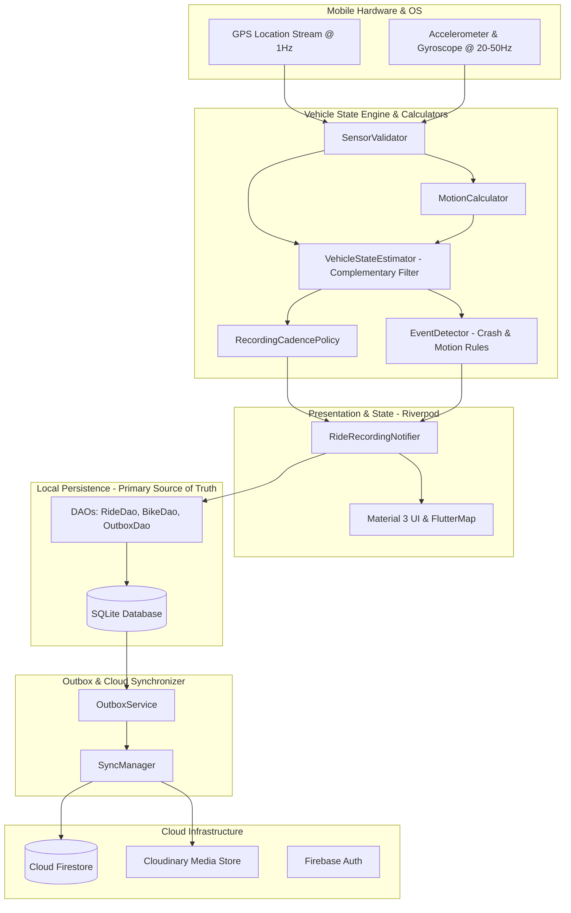

# ThrottleIQ Architecture (`arch.md`)

*Last updated: September 2026*

ThrottleIQ is an **offline-first motorcycle telemetry intelligence platform and vehicle state estimation engine**. Rather than merely logging raw GPS coordinates, ThrottleIQ treats a motorcycle ride as an evolving continuous state vector—fusing inertial measurement unit (IMU) telemetry with GPS fixes to classify dynamics, detect critical incidents (e.g., high-g crashes), manage vehicle fleets, and provide offline geometric navigation.

---

## 1. Architectural Principles

1. **Offline-First Source of Truth**:
   - Local SQLite is the sole author of ride, bike, and maintenance state.
   - Recording, crash detection, and local analytics work 100% offline without cellular or satellite internet access.
2. **Deterministic Outbox & Cloud Non-Interference**:
   - User actions (saving/sharing rides, logging maintenance) write to disk instantly.
   - Cloud synchronization is completely decoupled from UI threads. Network timeouts (capped at 8 seconds) transition items to `deferred` state rather than failing or blocking interactions.
3. **Layered Clean Architecture**:
   - **Presentation Layer**: Flutter widgets, Material 3 UI, Riverpod state notifiers.
   - **Domain Layer**: Pure mathematical domain calculators and entities with zero UI or database coupling.
   - **Data Layer**: Repositories, DAOs (Data Access Objects), and SQLite database helpers.
4. **Zero Cross-DAO Calls Inside Transactions**:
   - To prevent SQLite transaction deadlocks, a DAO method executing inside a transaction boundary must never invoke another DAO.
5. **Privacy by Design**:
   - Automatic 200m spatial clipping on the start and end of shared rides (obscuring homes and workplaces).
   - Unguessable tokenized URLs with 24-hour TTL for emergency live sharing.

---

## 2. High-Level System Architecture



---

## 3. Directory Structure

The project lives under [`app/lib/`](file:///Users/blackbird/Everything/dev/ThrottleIQ/app/lib) following a modular, feature-oriented structure:

```
app/lib/
├── app.dart                   # Root widget, lifecycle listener, theme & router setup
├── main.dart                  # Foreground task port init, Crashlytics, Firebase bootstrap
├── core/
│   ├── cloud/                 # Cloud sync, Outbox pattern, RideTrackCodec
│   │   ├── cloud_repository.dart
│   │   ├── outbox_service.dart
│   │   ├── ride_track_codec.dart
│   │   └── sync_manager.dart
│   ├── database/              # SQLite helper & DAOs
│   │   ├── daos/
│   │   │   ├── auto_detection_dao.dart
│   │   │   ├── bike_dao.dart
│   │   │   ├── maintenance_dao.dart
│   │   │   ├── outbox_dao.dart
│   │   │   ├── ride_dao.dart
│   │   │   └── ride_point_dao.dart
│   │   └── database_helper.dart
│   ├── constants/             # Sensor thresholds, bike catalog, app colors
│   ├── services/              # Background tracking, notifications, home widgets, Cloudinary
│   ├── router/                # GoRouter routing tree & auth redirects
│   └── theme/                 # 7-color family appearance engine (dark/light, boxy/curvy)
└── features/
    ├── ride/                  # Safety-critical: sensor fusion, crash detection, recording
    ├── garage/                # Bike management & market autocomplete
    ├── maintenance/           # Interval & distance-based service logs
    ├── social/                # Feed, privacy-zone clipping, group rides & live location
    ├── forums/                # Brand/model forums, thread/post moderation
    ├── poi_directory/         # Fuel, garage, spare-parts locator with geohash search
    ├── routes/                # Offline geometric turn-by-turn route navigation
    ├── chat/                  # Direct rider-to-rider messaging
    ├── profile/               # User settings, privacy tiers, SafeQR medical card
    └── stats/                 # Riding scores, badges, and aggregate statistics
```

---

## 4. Telemetry Pipeline & Vehicle State Engine

The core computational logic lives in pure domain calculators under [`app/lib/features/ride/domain/calculators/`](file:///Users/blackbird/Everything/dev/ThrottleIQ/app/lib/features/ride/domain/calculators).

### The 10-Layer Architecture
1. **Sensor Collection**: Ingests GPS fixes via `geolocator` and accelerometer/gyroscope streams via `sensors_plus`.
2. **Validation ([`SensorValidator`](file:///Users/blackbird/Everything/dev/ThrottleIQ/app/lib/features/ride/domain/calculators/sensor_validator.dart))**: Filters out anomalies—rejects negative elapsed times, speed spikes exceeding physical bounds (>80 m/s), non-finite floats, and GPS accuracy circles $>25\,\text{m}$.
3. **Time Synchronization**: Event-driven timestamping preserving device microsecond clocks across sensor types.
4. **Sensor Fusion ([`VehicleStateEstimator`](file:///Users/blackbird/Everything/dev/ThrottleIQ/app/lib/features/ride/domain/calculators/vehicle_state_estimator.dart))**:
   - Complementary filter blending GPS course over ground with integrated gyroscope $z$-axis (yaw rate).
   - High-accuracy GPS updates ($\le 8\,\text{m}$) bias heading heavily toward GPS ($95\%$), while degraded GPS leans on gyro dead-reckoning ($60\%$).
5. **Confidence Engine**: Dynamically calculates a $0-100$ heuristic score based on GPS horizontal dilution of precision and IMU jitter.
6. **Motion Classification**: Derives instantaneous states (`isMoving`, `isStopped`, `isCornering`, `isBraking`, `isAccelerating`).
7. **Event Detection ([`EventDetector`](file:///Users/blackbird/Everything/dev/ThrottleIQ/app/lib/features/ride/domain/calculators/event_detector.dart))**:
   - **Crash Detection Rule**:
     $$\text{Accel Spike} > 8g \;(78.48\,\text{m/s}^2) \;\land\; \text{Jerk} > 10\,\text{m/s}^3 \;\land\; \text{Speed Drop to } <2.0\,\text{m/s within } 2.0\,\text{s}$$
   - Crash signals require confidence validation to avoid triggering on phone drops or tunnel GPS dropouts.
   - Triggers an immediate maximum haptic pulse and initiates a **60-second cancellable countdown** on the UI.
8. **Adaptive Recording ([`RecordingCadencePolicy`](file:///Users/blackbird/Everything/dev/ThrottleIQ/app/lib/features/ride/domain/calculators/recording_cadence_policy.dart))**:
   - Thins points stored to SQLite during steady cruising (saves disk space and write I/O) while capturing dense points ($1\,\text{s}$ or $3\,\text{m}$) during dynamic maneuvering (braking, cornering, accelerating).
9. **Map Matching**: (Deferred / roadmap).
10. **Analytics**: Post-ride calculations of average speed (excluding extended idle periods $>60\,\text{s}$), lean estimates, jam duration, and safety scores.

---

## 5. Storage & Cloud Synchronization Architecture

### Local Storage (SQLite)
- Maintained by [`DatabaseHelper`](file:///Users/blackbird/Everything/dev/ThrottleIQ/app/lib/core/database/database_helper.dart).
- Migrations use `_addColumnIfMissing` to avoid `ALTER TABLE` lockouts and database recreation.
- `ride_points` table stores full high-fidelity trajectories (`lat`, `lng`, `speed`, `accel`, `heading`, `confidence`, `imu_quality`, `is_cornering`).

### Outbox Pattern ([`OutboxService`](file:///Users/blackbird/Everything/dev/ThrottleIQ/app/lib/core/cloud/outbox_service.dart))
- Network writes are queued into the SQLite `outbox` table before the UI callback completes.
- **Contract**: Once `enqueue()` returns, the operation is guaranteed to persist and eventually reach the cloud.
- `kOutboxAttemptTimeout = Duration(seconds: 8)`: If Firestore does not acknowledge within 8 seconds, the write is treated as `deferred` rather than throwing, preventing UI freezes during offline usage.
- Exponential backoff: $30\,\text{s} \to 1\,\text{m} \to 2\,\text{m} \dots \text{capped at } 30\,\text{m}$.

### Cloud Sync Engine ([`SyncManager`](file:///Users/blackbird/Everything/dev/ThrottleIQ/app/lib/core/cloud/sync_manager.dart))
- Triggered on:
  1. App resume (`AppLifecycleState.resumed`).
  2. User authentication state changes.
  3. Network connectivity restoration (`connectivity_plus`).
  4. Scheduled 5-minute background interval.
- **Sync Sequence**:
  1. Drain Outbox queue (`_outbox.drain()`).
  2. Download remote updates (Bikes, Maintenance, Rides) for multi-device parity.
  3. Push local deletions first.
  4. Upload unsynced local rows (`synced = 0`).

### Firestore Track Chunking ([`RideTrackCodec`](file:///Users/blackbird/Everything/dev/ThrottleIQ/app/lib/core/cloud/ride_track_codec.dart))
- Long rides generate thousands of telemetry points. Writing one document per point exhausts read/write quotas; writing all points to one document breaches Firestore's 1 MiB limit.
- **Chunking Strategy**: Points are grouped into 500-point arrays and stored in subcollection documents `/users/{uid}/rides/{rideId}/tracks/{chunkIndex}` using compact positional lists `[lat, lng, tsMillis, speed, accel, heading, confidence]`.

### Media Uploads
- Direct-to-storage architecture using **Cloudinary** ([`CloudinaryUploadService`](file:///Users/blackbird/Everything/dev/ThrottleIQ/app/lib/core/services/cloudinary_upload_service.dart)) via unsigned REST requests. Bypasses Firebase Storage to avoid Blaze billing lock-in while preserving free-tier quotas.

---

## 6. Background Processing & Auto-Tracking

1. **Foreground Service**:
   - Background tracking uses `flutter_foreground_task` and `geolocator`'s native foreground service notification to prevent Android OEM OS battery killers from terminating the recording isolate.
2. **Auto-Tracking Lifecycle ([`AutoTrackingService`](file:///Users/blackbird/Everything/dev/ThrottleIQ/app/lib/core/services/auto_tracking_service.dart))**:
   - Operates an isolated background entry point (`autoTrackingTaskCallback`).
   - Listens for Activity Recognition transitions (e.g., `IN_VEHICLE` / `ON_BICYCLE`).
   - Persists detected trip chunks to the `auto_detections` SQLite table.
3. **Reconciliation ([`AutoRideReconcilerService`](file:///Users/blackbird/Everything/dev/ThrottleIQ/app/lib/features/ride/data/repositories/auto_ride_reconciler_service.dart))**:
   - On app foregrounding, re-evaluates pending detected rides using [`AutoRideReconciler`](file:///Users/blackbird/Everything/dev/ThrottleIQ/app/lib/features/ride/domain/calculators/auto_ride_reconciler.dart).
   - Prompts the rider to categorize the journey or links it to their primary motorcycle.

---

## 7. Navigation & Routing Architecture

- Routing is implemented via `GoRouter` in [`app_router.dart`](file:///Users/blackbird/Everything/dev/ThrottleIQ/app/lib/core/router/app_router.dart).
- **Core Navigation Structure**:
  - `ShellRoute` with [`AppShell`](file:///Users/blackbird/Everything/dev/ThrottleIQ/app/lib/shared/widgets/app_shell.dart) hosts the 5 primary tabs:
    - **Social** (`/home/social`): Feed, ride sharing, group rides.
    - **Stats** (`/home/stats`): Aggregated metrics, riding scores, badges.
    - **Record** (`/home/record`): Live recording dashboard.
    - **Places** (`/home/places`): POI directory (garages, fuel, spare parts) with geohash queries.
    - **Maintenance** (`/home/maintenance`): Service log and interval tracking.
    - **Profile** (`/home/profile`): Garage fleet management, profile stats, settings.
  - **Full-Screen Workspaces**: High-focus screens exist outside the shell navigation bar:
    - `/ride/active`: Minimal, high-contrast, gloved-hand friendly UI during riding.
    - `/group-ride/:id`: Live peer map location sharing with push-to-talk audio notes.
    - `/routes/:id/navigate`: Turn-by-turn guidance.
- **Offline Geometric Turn-by-Turn**:
  - Operates without commercial routing APIs (Mapbox, GraphHopper). Computes turn maneuvers purely from polyline vector bearings and signed angular differences (classified into slight, normal, sharp, U-turn), grouping micro-bends to eliminate instruction noise.

---

## 8. Quality Gate & Testing Discipline

ThrottleIQ enforces strict verification rules governed by `.agents/rules/qa-gate.md`:

1. **Static Analysis**: Zero errors and warnings via `flutter analyze`.
2. **Real SQLite Testing (`sqflite_common_ffi`)**:
   - **Never mock DAOs** in database tests. All database tests run against real in-memory SQLite instances (`DatabaseHelper.instance.initInMemoryDatabase()`). Mocks hide transaction locking and deadlocks.
3. **Pure Logic Verification**:
   - All domain calculators (`MotionCalculator`, `VehicleStateEstimator`, `EventDetector`, `AutoRideReconciler`) maintain fixture-backed unit tests verifying mathematical edge cases.
4. **Security Rules Unit Tests**:
   - Firestore security rules are validated via the Firebase local emulator (`npm run test:rules` in `scripts/`).
